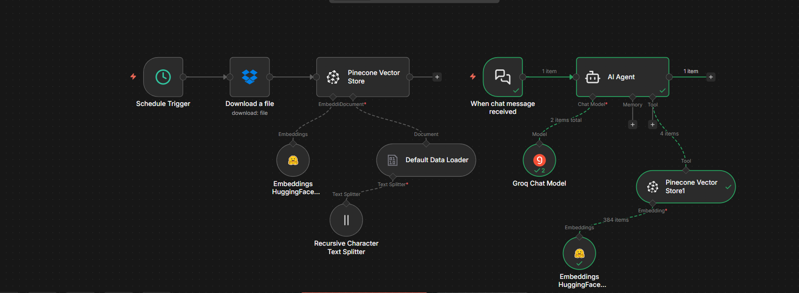

# Learner Support RAG Chatbot (n8n)

## 📌 Overview
This project is a **Retrieval-Augmented Generation (RAG) chatbot** built using **n8n**.
It acts as a **Learner Support Executive**, answering learner questions accurately using a provided **FAQ knowledge base**.

The chatbot retrieves relevant information from a **Pinecone vector database** and generates responses using a **large language model**, ensuring:
- No hallucinations
- Context-aware answers
- Professional learner-support tone

---

## 🎯 Use Case
- Learner support / customer support automation
- FAQ-based chatbot
- Internal knowledge assistant
- Education & EdTech platforms

---

## 🧠 Architecture (RAG Flow)

FAQ Document
↓
Text Splitter (Recursive Character)
↓
Hugging Face Embeddings (384-dim)
↓
Pinecone Vector Store
↓
User Question
↓
Relevant Context Retrieval
↓
LLM (Groq Chat Model)
↓
Final Answer

---

## ⚙️ Tech Stack

| Component | Tool |
|---------|------|
Workflow Orchestration | n8n |
Vector Database | Pinecone |
Embeddings | Hugging Face (`sentence-transformers/all-MiniLM-L6-v2`) |
LLM | Groq Chat Model |
Chunking | Recursive Character Text Splitter |

---

## ✨ Key Features
- ✅ FAQ-based accurate answers
- ✅ Context-only responses (no guessing)
- ✅ Professional learner-support behavior
- ✅ Secure secret handling
- ✅ Modular & scalable RAG design

---

## 🧩 Workflow Description

### Indexing Flow
- Downloads FAQ document
- Splits text into chunks
- Generates embeddings using Hugging Face
- Stores vectors in Pinecone

### Chat Flow
- Receives user message
- Retrieves relevant chunks from Pinecone
- Passes context to AI Agent
- Responds as a Learner Support Executive

---

## 🧠 System Prompt
The chatbot behavior is controlled using a system prompt designed for learner support:
- Polite and professional tone
- Answers strictly from provided context
- Safe fallback when information is unavailable

(See `prompts/system_prompt.md`)

---
## 📂 Project Structure

rag-learner-support-chatbot-n8n/
│
├── workflow/
│ └── learner-support-rag-workflow.json
│
├── prompts/
│ └── system_prompt.md
│
├── screenshots/
│ └── n8n-workflow.png
│
├── .env.example
├── README.md
└── LICENSE

---

## 🚀 How to Use

1. Import the workflow JSON into n8n
2. Set environment variables / credentials
3. Upload FAQ document
4. Run indexing workflow
5. Start chatting with the bot

---

## 📌 Limitations & Future Improvements
- Add conversation memory
- Multi-language support
- Role-based escalation
- UI integration (WhatsApp / Web chat)

---

## 🏁 Conclusion
This project demonstrates a **real-world RAG implementation** using modern AI tooling.
It is suitable for production use and showcases strong skills in **AI automation, vector databases, and prompt engineering**.

